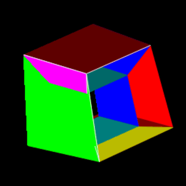

# 4D Shape Visualizer



A Python application for visualizing and interacting with 4-dimensional geometric shapes in real-time.

## Features
- Load and display 4D shapes from `.4ds` files
- Real-time 4D and 3D rotations
- Interactive W-slice control for 4D cross sections
- Translucent face rendering
- Shape translation in viewing space

## Controls
- **4D Rotations**
  - Q/W: First 4D plane
  - A/S: Second 4D plane
  - Z/X: Third 4D plane

- **3D Rotations**
  - R/T: X axis
  - F/G: Y axis
  - V/B: Z axis

- **Navigation**
  - Arrow Keys: Translation
  - Page Up/Down: Vertical movement
  - Up/Down: W-slice control

## Installation
```bash
pip install pygame numpy
```

## Usage
1. Place .4ds shape files in the shapes/ directory
2. Run the visualizer:
```bash
python main.py
```

## Shape File Format
Shapes are defined in .4ds JSON files containing:

* vertices: 4D coordinates
& edges: vertex connections
& faces: polygonal face definitions
& face_colors: RGBA values for each face

## Examples
* tesseract.4ds: 4D hypercube
* pentachoron.4ds: 4D simplex (triangular pyramid)

## Requirements
* Python 3.7+
* pygame
* numpy