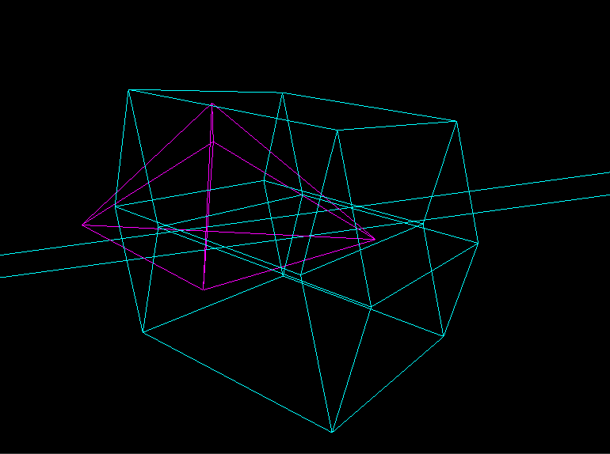
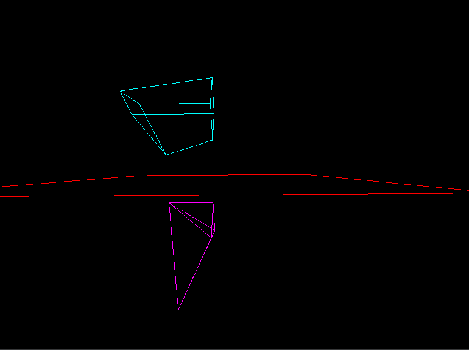
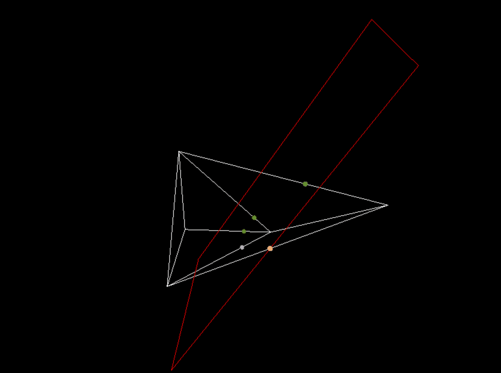
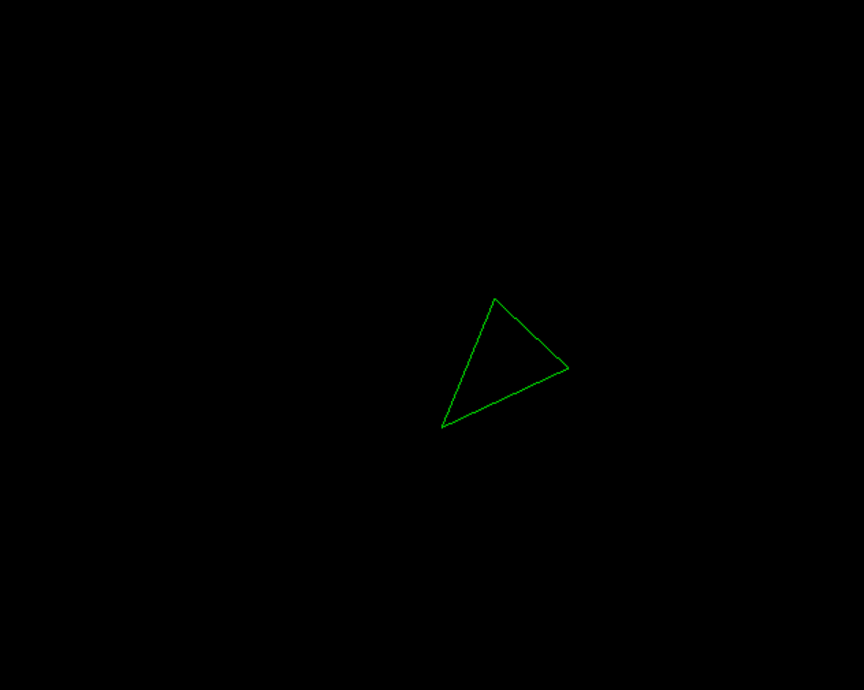
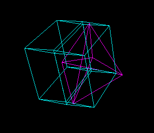

# 4D to 3D Mapping
Hey there!

This project allows you to construct 4D objects and then view hyperplanes or "3D slices" of the 4D world.

This could be used for all sorts of mind-bending visualizations, and could be easily replicated into C++ or another more performant language.

## 3D Analogue
The 3D analogue of this project is a 2D world with 3D planar slices. This is a bit easier to visualize, so I've included a demo of that as well.
This technique is then applied to 4D and 3D, respectively. So changing the angle changes the "space" that you're looking at, which is then rendered with OpenGL.

Here's a combined example 3D visualization with the 3D objects and 2D projection as an overlay:

Here's a seperated example 3D visualization:

Here is the same shape (not synced / same movements) projected onto 2D:

## 4D Visualization

## Running Yourself
You'll need to have Python installed. This was run on Python 3.11, but newer versions should (?) work as well.
Python scripts are run as usual.

Cheers!

## AI Statement
Comments generated by AI.
